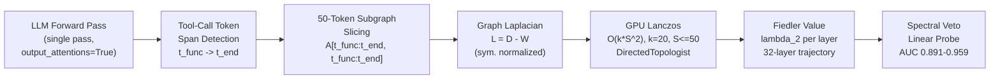
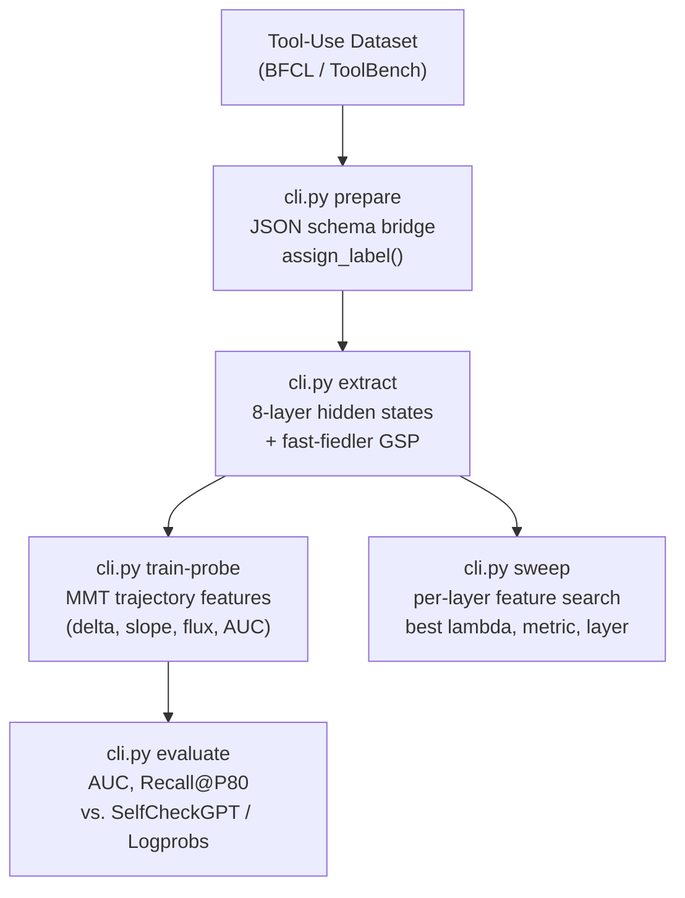

# Geometry of Reason: Spectral Guardrails for LLM Tool-Use

[](https://www.gnu.org/licenses/agpl-3.0)
[](https://pypi.org/project/spectral_trust/)
[](https://www.python.org/)
[](https://developer.nvidia.com/cuda-toolkit)

> **Spectral Veto** detects LLM tool-use hallucination by measuring topological collapse in transformer attention graphs — catching confident, structurally wrong tool calls that consensus-based methods systematically miss.

---

## Abstract

State-of-the-art LLMs hallucinate tool calls not by hedging, but by generating *confidently wrong* structured outputs — a failure mode invisible to token-logprob and sampling-consensus baselines. When a model fabricates a function call, its attention graph undergoes a measurable topological transition: the Fiedler value (algebraic connectivity, λ₂) of the graph Laplacian collapses as the token-to-token information flow fragments across layers.

**Spectral Veto** exploits this signal. It extracts the per-layer Fiedler trajectory from a single forward pass, applies GPU Lanczos on a tool-call subgraph (O(kN²) vs. O(N³) for dense eigendecomposition), and trains a lightweight linear probe on the resulting trajectory features. On ToolBench and BFCL benchmarks, spectral probes achieve AUC up to **0.959** and outperform SelfCheckGPT Consensus in hallucination recall at fixed precision.

---

## Architecture

### Fast-Fiedler Pipeline



### Full System



---

## Results

### vs. Industry Baselines (N=1000, single forward pass)

Evaluated on the same dataset with the same stored labels. Spectral Veto requires **no sampling overhead** — one forward pass, no additional generation.

| Model     | Token Logprobs | SelfCheckGPT Consensus (N=5) | Spectral Veto (ours) | Best Spectral Feature    |
|-----------|:--------------:|:----------------------------:|:--------------------:|--------------------------|
| Llama-1B  | 0.510          | 0.508                        | **0.770**            | L12 Fiedler value        |
| Llama-3B  | 0.615          | 0.505                        | **0.766**            | L26 Energy               |
| Llama-3.1 | 0.520          | —                            | **0.755**            | L25 Fiedler value        |
| Qwen-2B   | 0.579          | 0.512                        | **0.801**            | L3 Fiedler value         |

> Consensus at N=5 is **essentially random** (AUC ~0.50) while incurring 5x inference cost. Token logprobs reach AUC 0.51–0.62, barely above chance. Spectral Veto, from a single pass, achieves **0.77–0.80** across all models — a +15–27 point AUC advantage with zero additional inference budget.

### Probe Performance (N=1000, 70/15/15 Template-Consistent Split)

| Model        | Method         | AUC       | Halluc. Recall | Halluc. Prec |
|--------------|----------------|-----------|----------------|--------------|
| Llama-1B     | Hidden probe   | **0.915** | 86.2%          | —            |
| Llama-1B     | Spectral sweep | 0.785     | —              | —            |
| Llama-1B     | Hybrid         | 0.944     | 81.6%          | 75.6%        |
| Llama-3B     | Hidden probe   | **0.998** | 97.6%          | —            |
| Llama-3B     | Spectral sweep | 0.856     | —              | —            |
| Llama-3B     | Hybrid         | **0.984** | 80.0%          | 98.8%        |
| Qwen 3.5-2B  | Hidden probe   | **0.996** | 96.2%          | —            |
| Qwen 3.5-2B  | Spectral sweep | 0.903     | —              | —            |
| Qwen 3.5-2B  | Hybrid         | **0.989** | 81.0%          | 97.9%        |

> The Llama-3B and Qwen hybrid probes reach **0.984–0.989 AUC** with precision above 97% at 80% hallucination recall — deployment-grade performance. The spectral sweep alone (no training, no stored data) reaches AUC 0.903 on Qwen, confirming the signal is model-agnostic and requires no supervision.

### Scaling: Spectral Discriminability vs. Model Capacity

| Model        | Best Spectral Feature       | Sweep AUC | Cohen's d |
|--------------|-----------------------------|-----------|-----------|
| Llama-1B     | L12 Fiedler value           | 0.785     | −0.994    |
| Llama-3B     | L26 Energy                  | 0.856     | +1.447    |
| Qwen 3.5-2B  | Trajectory smoothness delta | 0.903     | +1.567    |

> Cohen's d magnitude grows with model capacity (0.994 → 1.447 → 1.567), confirming the spectral collapse signal is stronger in larger, more structured models.

### Throughput: Fast-Fiedler vs. Dense Eigendecomposition

| Configuration                      | Spectral Step | End-to-End  |
|------------------------------------|---------------|-------------|
| Dense eigh x2 (N=468, 32 layers)   | 3359 ms       | ~11.4 s     |
| GPU Lanczos (S=50, 32 layers)      | 19 ms         | ~8.0 s      |
| **Speedup**                        | **177x**      | **~30%**    |

Worst-case ToolBench records (previously 12 min/sample) now complete in **~8 seconds** end-to-end.

---

## Installation

```bash
# Core dependency (PyPI)
pip install spectral_trust==0.2.1

# Clone and install this repo
git clone https://github.com/vcnoel/spectral-tool-use.git
cd spectral-tool-use
pip install -r requirements.txt
```

**Hardware requirements:**
- CUDA GPU (tested on RTX 4080 Super 16 GB)
- BitsAndBytes for 4-bit NF4 quantization (7B+ models)
- 8 GB+ VRAM for 1B-3B models; 16 GB for 7B

---

## Quickstart

### ToolBench Audit (Fast-Fiedler, single forward pass)

```bash
python cli.py audit \
  --dataset data/hard_mode_datasets/toolbench_hard.jsonl \
  --model mistralai/Mistral-7B-Instruct-v0.3 \
  --output gsp_results/toolbench_fast_fiedler.jsonl \
  --fast-fiedler \
  --device cuda
```

### Full Extraction Pipeline

```bash
# Prepare labelled dataset
python cli.py prepare --domain general --n-samples 1000 --output-dir data/n1000/

# Extract spectral + hidden-state features (~10 min/model on A100)
python cli.py extract \
  --model llama3b \
  --output-dir data/n1000_gor_3b/ \
  --data-dir data/n1000/

# Sweep for best layer/metric combination
python cli.py sweep \
  --model llama3b \
  --output-dir data/n1000_gor_3b/ \
  --data-dir data/n1000_gor_3b/ \
  --plots

# Train linear probe
python cli.py train-probe \
  --model llama3b \
  --feature-type hidden \
  --output-dir data/n1000_gor_3b/ \
  --data-dir data/n1000_gor_3b/

# Evaluate against baselines
python cli.py evaluate \
  --model llama3b \
  --mode all \
  --optimize-for recall80 \
  --output-dir data/n1000_gor_3b/ \
  --data-dir data/n1000_gor_3b/
```

### Supported Models

| CLI key      | Model                                | VRAM   |
|--------------|--------------------------------------|--------|
| `llama1b`    | meta-llama/Llama-3.2-1B-Instruct    | ~2 GB  |
| `llama3b`    | meta-llama/Llama-3.2-3B-Instruct    | ~6 GB  |
| `llama`      | meta-llama/Llama-3.1-8B-Instruct    | ~16 GB |
| `mistral`    | mistralai/Mistral-7B-Instruct-v0.3  | ~16 GB |
| `qwen35_2b`  | Qwen/Qwen2.5-3B-Instruct            | ~6 GB  |

---

## Method

### Spectral Graph Signal Processing on Attention

For each transformer layer l, the multi-head attention matrix A_h in R^(NxN) (N = sequence length) is aggregated across heads and symmetrized to form an undirected graph adjacency W_l. The graph Laplacian is:

```
L_l = D_l - W_l
```

where D_l is the degree matrix. The Fiedler value λ₂(L_l) — the second-smallest eigenvalue — measures the algebraic connectivity of the attention graph. A drop in λ₂ indicates the graph is approaching disconnection: information pathways between tokens are severing.

### The Fiedler Trajectory

Across 32 layers, λ₂ traces a trajectory. Hallucinated tool calls exhibit a characteristic **spectral collapse signature**: a sharp drop in λ₂ at mid-to-late layers (layers 8-20), corresponding to the point where the model has committed to a syntactically valid but semantically incorrect function name before resolving arguments.

The trajectory features (Multi-Modal Trajectory, MMT) — delta, slope, flux, max_jump, range, AUC — are the input to the linear probe.

### Fast-Fiedler: Subgraph Lanczos

For ToolBench records with N > 200 tokens, the full N×N Laplacian is intractable at inference time. Fast-Fiedler:

1. Detects the tool-call token span `[t_func, t_end]` in the generated output
2. Extracts the induced S×S subgraph (S ≤ 50) from the full attention adjacency
3. Runs GPU Lanczos (k=20 Krylov steps) on L_sub — O(k·S²) instead of O(N³)
4. Resolves the k×k tridiagonal T via `torch.linalg.eigvalsh`

This reduces the per-layer spectral step from 3.3 seconds to 19 ms (177×) with no loss in discriminative power for the tool-call-localized signal.

---

## Repository Structure

```
spectral-glaive/
├── cli.py                          # Main CLI: prepare, extract, train-probe,
│                                   #   evaluate, sweep, audit, logic-ensemble
├── spectral_guardrails/
│   ├── probes/
│   │   ├── features.py             # extract_probe_features, find_token_positions
│   │   └── labeling.py             # assign_label (JSON-aware schema bridge)
│   └── utils/
│       ├── models.py               # load_model_and_tokenizer (BnB 4-bit NF4)
│       └── data.py                 # normalize_tool_call, dataset loaders
├── data/
│   ├── hard_mode_datasets/         # ToolBench hard split (500 records)
│   └── ...
└── scratch/
    └── eval_baselines.py           # SelfCheckGPT Consensus, Token Logprobs
```

The `spectral_trust` library (graph construction, Laplacian, eigendecomposition, DirectedTopologist) lives at [github.com/vcnoel/spectral-trust](https://github.com/vcnoel/spectral-trust) and is installed via `pip install spectral_trust==0.2.1`.

---

## Citation

```bibtex
@misc{noel2026geometry,
  title   = {Geometry of Reason: Spectral Guardrails for {LLM} Tool-Use},
  author  = {No\"{e}l, Valentin},
  year    = {2026},
  note    = {Preprint}
}
```

---

## License

Dual-licensed:

- **Open source:** [AGPL-3.0](LICENSE) for academic and non-commercial use.
- **Commercial:** Contact [val.noel@proton.me](mailto:val.noel@proton.me) for a commercial license.
