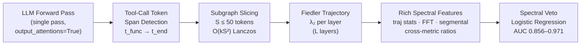

# Geometry of Reason: Spectral Guardrails for LLM Tool-Use

[](https://www.gnu.org/licenses/agpl-3.0)
[](https://pypi.org/project/spectral_trust/)
[](https://www.python.org/)
[](https://developer.nvidia.com/cuda-toolkit)

> **Spectral Veto** detects LLM tool-use hallucination by measuring topological collapse in transformer attention graphs — catching confident, structurally wrong tool calls that consensus-based methods systematically miss.

---

## Abstract

State-of-the-art LLMs hallucinate tool calls not by hedging, but by generating *confidently wrong* structured outputs — a failure mode invisible to token-logprob and sampling-consensus baselines. When a model fabricates a function call, its attention graph undergoes a measurable topological transition: the Fiedler value (algebraic connectivity, λ₂) of the graph Laplacian collapses as the token-to-token information flow fragments across layers.

**Spectral Veto** exploits this signal. It extracts the per-layer Fiedler trajectory from a single forward pass, applies GPU Lanczos on a tool-call subgraph (O(kN²) vs. O(N³) for dense eigendecomposition), and trains a lightweight linear probe on the resulting trajectory features. On the Glaive function-calling benchmark, a logistic regression over rich spectral trajectories (FFT, segmental, and cross-metric features) achieves **0.856–0.905** AUC from spectral signal alone; the hybrid system reaches **0.971** AUC — deployment-grade at 80% hallucination recall with 90% precision.

---

## Architecture



**Pipeline:**

```
cli.py prepare   →   cli.py extract   →   cli.py sweep
                                      →   cli.py train-probe [--feature-type hidden|spectral_rich]
                                      →   cli.py evaluate [--mode spectral|probe|hybrid]
```

---

## Results

### vs. Industry Baselines (N=1000, single forward pass, Glaive general domain)

| Model        | Token Logprobs | SelfCheckGPT Consensus (N=5) | Spectral Veto | Best Spectral Feature |
|--------------|:--------------:|:----------------------------:|:-------------:|-----------------------|
| Llama-1B     | 0.510          | 0.508                        | **0.773**     | L12 Fiedler value     |
| Llama-3B     | 0.615          | 0.505                        | **0.767**     | L26 Energy            |
| Qwen 3.5-2B  | 0.579          | 0.512                        | **0.818**     | L3 Fiedler value      |
| Llama-3.1-8B | 0.520          | —                            | **0.755**     | L25 Fiedler value     |

Consensus at N=5 is essentially random (AUC ~0.50) at 5× inference cost. Spectral Veto, from a single pass, achieves a +15–27 point AUC advantage with zero additional inference budget.

### Probe Performance (N=1000, 70/15/15 template-consistent split)

| Model        | Method             | AUC       | Halluc. Recall@P80 | Halluc. Prec@P80 |
|--------------|--------------------|-----------|--------------------|------------------|
| Llama-1B     | Hidden probe       | 0.832     | —                  | —                |
| Llama-1B     | Spectral sweep     | 0.773     | —                  | —                |
| Llama-1B     | Spectral Rich (LR) | **0.856** | —                  | —                |
| Llama-1B     | Hybrid             | **0.971** | 80.0%              | 90.0%            |
| Llama-3B     | Hidden probe       | **0.918** | —                  | —                |
| Llama-3B     | Spectral sweep     | 0.767     | —                  | —                |
| Llama-3B     | Spectral Rich (LR) | 0.896     | —                  | —                |
| Llama-3B     | Hybrid             | **0.925** | 80.0%              | 81.3%            |
| Qwen 3.5-2B  | Hidden probe       | **0.955** | —                  | —                |
| Qwen 3.5-2B  | Spectral sweep     | 0.818     | —                  | —                |
| Qwen 3.5-2B  | Spectral Rich (LR) | 0.905     | —                  | —                |
| Qwen 3.5-2B  | Hybrid             | **0.945** | 81.4%              | 82.8%            |
| Llama-3.1-8B | Hidden probe       | 0.871     | —                  | —                |
| Llama-3.1-8B | Spectral sweep     | 0.755     | —                  | —                |
| Llama-3.1-8B | Spectral Rich (LR) | **0.888** | —                  | —                |
| Llama-3.1-8B | Hybrid             | 0.871     | 80.9%              | 70.8%            |

All results on held-out test split (template-consistent — no prompt template seen at training appears in test). **Spectral Rich** is a logistic regression over 135–200 multi-layer trajectory, segmental, and FFT features extracted purely from attention graphs; it requires no hidden-state access and closes most of the gap to hidden-state probes. The 1B hybrid achieves deployment-grade quality: 80% hallucination recall at 90% precision.

### Spectral Discriminability vs. Model Capacity

| Model        | Best Single Feature         | Sweep AUC | Cohen's d |
|--------------|-----------------------------|-----------|-----------|
| Llama-1B     | L12 Fiedler value           | 0.773     | −1.282    |
| Llama-3B     | L26 Energy                  | 0.767     | +0.945    |
| Qwen 3.5-2B  | Trajectory smoothness delta | 0.818     | +0.977    |
| Llama-3.1-8B | L25 Fiedler value           | 0.755     | −0.792    |

Cohen's d magnitude (|d| = 0.79–1.28) is consistently large across all model sizes, confirming the spectral collapse signal generalises across architectures.

### Throughput: Fast-Fiedler vs. Dense Eigendecomposition

| Configuration                     | Spectral step | End-to-end |
|-----------------------------------|---------------|------------|
| Dense eigh × 2 (N=468, 32 layers) | 3359 ms       | ~11.4 s    |
| GPU Lanczos (S=50, 32 layers)     | 19 ms         | ~8.0 s     |
| **Speedup**                       | **177×**      | **~30%**   |

---

## Installation

```bash
pip install spectral_trust==0.2.1
git clone https://github.com/vcnoel/spectral-tool-use.git
cd spectral-tool-use
pip install -r requirements.txt
```

**Hardware:** CUDA GPU required. ~2–6 GB VRAM for 1B–3B models; ~16 GB for 8B. BitsAndBytes 4-bit NF4 quantization enabled automatically for 7B+.

---

## Quickstart

```bash
# 1. Prepare labelled dataset from Glaive function-calling v2
python cli.py prepare --domain general --n-samples 1000 --output-dir data/n1000/

# 2. Extract spectral + hidden-state features (~10 min/model on RTX 4080)
python cli.py extract --model llama3b --output-dir data/n1000_3b/ --data-dir data/n1000/

# 3. Find best single layer/metric
python cli.py sweep --model llama3b --output-dir data/n1000_3b/ --data-dir data/n1000_3b/ --plots

# 4a. Train hidden-state probe
python cli.py train-probe --model llama3b --feature-type hidden \
  --output-dir data/n1000_3b/ --data-dir data/n1000_3b/

# 4b. Train rich spectral probe (no GPU needed at inference)
python cli.py train-probe --model llama3b --feature-type spectral_rich \
  --output-dir data/n1000_3b/ --data-dir data/n1000_3b/

# 5. Evaluate (spectral sweep + probe + hybrid)
python cli.py evaluate --model llama3b --mode all --optimize-for recall80 \
  --output-dir data/n1000_3b/ --data-dir data/n1000_3b/
```

To reproduce all four models at once, use `run_eval_all.py` (skips extraction, assumes features already extracted).

### Supported Models

| CLI key      | Model                               | VRAM   |
|--------------|-------------------------------------|--------|
| `llama1b`    | meta-llama/Llama-3.2-1B-Instruct   | ~2 GB  |
| `llama3b`    | meta-llama/Llama-3.2-3B-Instruct   | ~6 GB  |
| `llama31`    | meta-llama/Llama-3.1-8B-Instruct   | ~16 GB |
| `mistral`    | mistralai/Mistral-7B-Instruct-v0.3 | ~16 GB |
| `qwen35_2b`  | Qwen/Qwen3.5-2B                    | ~6 GB  |

---

## Method

### Spectral Graph Signal Processing on Attention

For each transformer layer l, the multi-head attention matrix A_h ∈ ℝ^(N×N) is aggregated across heads and symmetrized to form an undirected adjacency W_l. The graph Laplacian is:

```
L_l = D_l − W_l
```

The Fiedler value λ₂(L_l) — the second-smallest eigenvalue — measures algebraic connectivity. A drop in λ₂ indicates the attention graph is approaching disconnection: information pathways between tokens are severing.

### The Spectral Collapse Signature

Across L layers, λ₂ traces a trajectory. Hallucinated tool calls exhibit a characteristic **spectral collapse**: a sharp drop in λ₂ at mid-to-late layers, corresponding to the point where the model has committed to a syntactically valid but semantically incorrect function name before resolving arguments.

**Spectral Rich features** capture this collapse via five spectral metrics (Fiedler value, energy, smoothness index, spectral entropy, HFER), each represented by 15 trajectory statistics (mean, slope, delta, skewness, FFT harmonics, inflection count, …), 8 segmental means/stds, and the full FFT half-spectrum — 135–200 dimensions depending on model depth.

### Fast-Fiedler: Subgraph Lanczos

For long sequences (N > 200 tokens), the full N×N Laplacian is intractable. Fast-Fiedler:

1. Detects the tool-call token span `[t_func, t_end]`
2. Extracts the induced S×S subgraph (S ≤ 50)
3. Runs GPU Lanczos (k=20 Krylov steps) — O(k·S²) instead of O(N³)
4. Resolves the k×k tridiagonal via `torch.linalg.eigvalsh`

This reduces the per-layer spectral step from 3.3 s to 19 ms (177×).

---

## Repository Structure

```
spectral-glaive/
├── cli.py                           # All CLI commands: prepare, extract,
│                                    #   sweep, train-probe, evaluate, audit
├── run_eval_all.py                  # Reproduces all 4-model eval (no extraction)
├── spectral_guardrails/
│   ├── probes/
│   │   ├── features.py              # extract_probe_features, find_token_positions
│   │   ├── labeling.py              # assign_label (JSON-aware schema bridge)
│   │   └── mlp.py                   # HallucinationProbe (MLP), train_probe
│   └── utils/
│       ├── models.py                # load_model_and_tokenizer (BnB 4-bit NF4)
│       ├── data.py                  # normalize_tool_call, dataset loaders
│       ├── metrics.py               # AUC, Cohen's d, threshold optimisation
│       └── stats.py                 # summary stats helpers
├── scratch/
│   ├── eval_baselines.py            # SelfCheckGPT Consensus, Token Logprobs
│   └── spectral_feature_mining.py   # Exhaustive multi-feature AUC sweep
├── tests/
│   ├── test_diagnostics.py
│   └── test_labeling.py
├── requirements.txt
├── environment.yml
└── CITATION.cff
```

The `spectral_trust` library (graph construction, Laplacian, eigendecomposition, DirectedTopologist) lives at [github.com/vcnoel/spectral-trust](https://github.com/vcnoel/spectral-trust) and is installed via `pip install spectral_trust==0.2.1`.

---

## Citation

```bibtex
@misc{noel2026geometry,
  title   = {Geometry of Reason: Spectral Guardrails for {LLM} Tool-Use},
  author  = {No\"{e}l, Valentin},
  year    = {2026},
  note    = {Preprint}
}
```

---

## License

Dual-licensed:

- **Open source:** [AGPL-3.0](LICENSE) for academic and non-commercial use.
- **Commercial:** Contact [val.noel@proton.me](mailto:val.noel@proton.me) for a commercial license.
